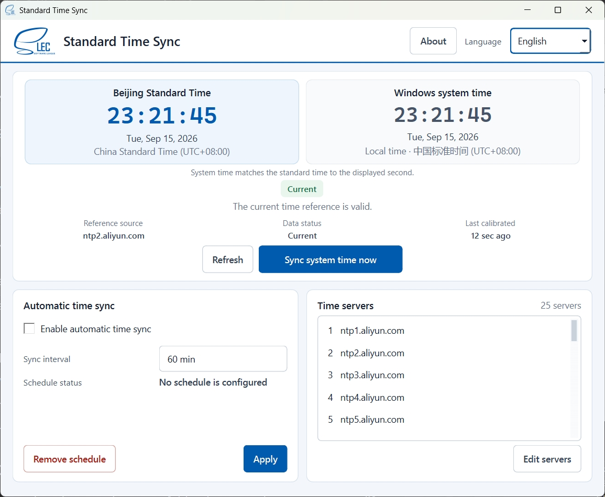

# TimeSync


[English](README.md) | 简体中文

TimeSync 是 Windows 桌面应用，用于对照标准北京时间（UTC+08:00）与 Windows 系统时钟，并支持立即同步或定时校时。



版本 **1.0.0** · 发布者：**乐程软件工作室 / LEC Software Studio**

## 在 Windows 上运行

根据收到的软件包启动程序：

| 软件包 | 启动方式 |
| --- | --- |
| `TimeSync-portable.zip` | 完整解压应用文件夹，保留其中的 Qt 运行库文件，然后打开 `TimeSync.exe`。 |
| `TimeSync-static.exe` | 将这个单文件程序放入应用文件夹后打开。 |

将程序放在普通用户无权修改的文件夹中：程序以提升后的权限运行，定时校时也会使用这些权限。

启动时接受 Windows 用户账户控制（UAC）提示。修改系统时钟和管理计划任务需要管理员权限。

允许访问出站 **UDP 123 端口**，以便查询 NTP 时间。TimeSync 支持 IPv4 和 IPv6 时间服务器。

初始界面语言为简体中文。通过 **界面语言 / Language** 下拉框选择 **English** 或 **简体中文**。英文窗口标题为 **Standard Time Sync**，中文窗口标题为 **标准时间同步**。

## 查看与同步时间

1. 查看标准北京时间和 Windows 系统时间面板，两者的时钟差值显示在面板下方。
2. 点击 **刷新** 获取新的 NTP 样本，Windows 系统时钟保持不变。
3. 点击 **立即同步系统时间**，使用经过验证的标准时间设置 Windows 时钟。当前样本仍有效时，TimeSync 使用该样本；否则先查询 NTP，再设置时钟。

点击 **编辑服务器** 修改时间来源并保存列表。默认列表包含来自阿里云、NIM 和 CERNET 的 **25 台服务器**。

通过 UDP 传输的 NTP 不提供服务器真实性的密码学保证。样本验证包含原始时间戳检查，用于将回复与请求关联起来。

## 设置自动校时

1. 在 **自动校时计划** 中勾选 **启用自动校时**。
2. 将 **校时间隔** 设为 **1 至 10080 分钟**，默认值为 **60 分钟**。
3. 点击 **应用**，创建或更新 Windows 任务计划程序中的任务，然后查看 **计划状态**。

要删除任务，点击 **移除计划** 并确认移除。

任务会以当前管理员用户的身份、使用最高权限，启动配置计划时所运行的同一个 TimeSync 可执行文件。将该程序保留在安装文件夹中，以便任务继续启动它。

## 配置文件

通过图形界面修改服务器、校时计划和语言。设置保存在可执行文件旁的 `config.ini` 中。

文件采用 UTF-8 编码，恰好包含三个字段，每行一个，不含注释或节标题。以下示例使用三台示例服务器：

```ini
servers = ntp1.aliyun.com, ntp2.aliyun.com, ntp1.nim.ac.cn
scheduleIntervalMinutes = 60
language = zh-CN
```

| 字段 | 可用值 |
| --- | --- |
| `servers` | 以逗号分隔的 NTP 服务器列表，通过 **编辑服务器** 管理。 |
| `scheduleIntervalMinutes` | `1` 至 `10080` 的整数，单位为分钟，默认为 `60`。 |
| `language` | `zh-CN` 表示简体中文（默认），`en-US` 表示英文。 |

已有配置无效时，程序会保留该文件并报告错误。按上述格式修正后重试。

## 命令行用法

在应用文件夹中运行以下命令；方括号表示可选参数：

```text
TimeSync.exe
TimeSync.exe --sync-once [--dry-run] [--config <path>]
TimeSync.exe --install-task [--config <path>]
TimeSync.exe --remove-task [--config <path>]
TimeSync.exe --help
```

- 不带参数启动时打开图形界面。
- `--sync-once` 执行一次同步；添加 `--dry-run` 后，仅获取并打印 NTP 样本，系统时钟保持不变。
- `--install-task` 按配置中的间隔创建或更新计划任务。
- `--remove-task` 删除计划任务。
- `--config <path>` 为本次操作指定配置文件。
- `--help` 显示用法说明。

## 编译与打包

构建环境：**Windows x64**、包含 Core、Network 和 Widgets 的 **Qt 6.9.1 MinGW 64-bit**、支持 **C++20** 的 **MinGW-w64**、**CMake 3.22+** 以及 **Ninja**。

在源码目录中运行命令，将尖括号占位符替换为 Qt 安装前缀和工具路径。示例使用 shell 风格的 `\` 续行符；在 PowerShell 或命令提示符中，将每条跨行命令合并为一行，并去掉行尾的 `\`。含空格的路径需加引号。

### 使用共享 Qt 的应用文件夹

```sh
cmake -S . -B build -G Ninja -DCMAKE_BUILD_TYPE=Release \
  -DCMAKE_PREFIX_PATH=<shared-Qt-prefix> \
  -DCMAKE_CXX_COMPILER=<path-to-g++.exe> \
  -DCMAKE_MAKE_PROGRAM=<path-to-ninja.exe>
cmake --build build --parallel
ctest --test-dir build --output-on-failure
cmake --build build --target deploy-portable
```

使用共享 Qt 构建时，`deploy-portable` 会将 `TimeSync.exe` 及其 Qt 运行库复制到 `build/deploy`。

### 静态单文件程序

使用单独编译的静态 Qt 6.9.1 `qtbase`，其中须包含 Windows 平台插件（`QWindowsIntegrationPlugin`）和 Schannel TLS 插件（`QSchannelBackendPlugin`）。

```sh
cmake -S . -B build-static -G Ninja -DCMAKE_BUILD_TYPE=Release \
  -DCMAKE_PREFIX_PATH=<static-Qt-prefix> \
  -DCMAKE_CXX_COMPILER=<path-to-g++.exe> \
  -DCMAKE_MAKE_PROGRAM=<path-to-ninja.exe>
cmake --build build-static --parallel
```

## 常见问题处理

| 问题 | 处理方式 |
| --- | --- |
| 所有时间来源均无响应 | 检查出站 UDP `123` 端口是否可访问，并通过 **编辑服务器** 检查配置的服务器。 |
| Windows 拒绝调整时钟 | 重新打开应用并接受 UAC 提示，请管理员检查本地安全策略中的 **更改系统时间** 用户权限。 |
| 定时校时失败 | 从安装文件夹中以管理员权限启动应用，再次应用校时计划。 |

## 发布者与许可证

**关于** 对话框展示乐程软件工作室（LEC Software Studio）的名称，并提供[工作室官网](https://lec-page-2026.ziroo.cn/)和 [GitHub 组织](https://github.com/lec-org)链接。

TimeSync 采用 [GNU Affero General Public License v3.0](LICENSE) 许可证。
